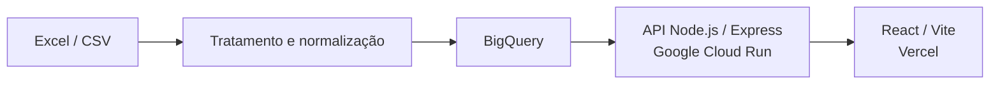

# Painel Financeiro da Rede Estadual — Case BI

Dashboard executivo desenvolvido para análise da gestão financeira da rede estadual de ensino de Minas Gerais. O projeto apresenta o ciclo completo de uma solução de BI: tratamento e integração de dados, modelagem analítica no BigQuery, API de consulta e interface web orientada à tomada de decisão.

**Dashboard público:** [desafio-bi-see-mg.vercel.app](https://desafio-bi-see-mg.vercel.app)

## Visão geral

O case parte de duas fontes com identificadores diferentes:

- cadastro de escolas identificado pelo código INEP;
- histórico de pagamentos de um sistema legado identificado apenas pelo `CodEsc`.

O dashboard considera exclusivamente escolas da rede **ESTADUAL** e pagamentos do ano de **2026**. Além da visão executiva, a aplicação documenta as regras de integração, os tratamentos aplicados e as limitações metodológicas da base.

## Arquitetura



A API disponibiliza somente operações de leitura. O frontend consulta os dados agregados e aplica filtros globais diretamente sobre o recorte analítico processado no BigQuery.

## Stack

- React
- TypeScript
- Vite
- Recharts
- Node.js
- Express
- BigQuery
- Google Cloud Run
- Vercel

## Modelagem e integração

A principal regra de integração identificada foi a equivalência entre os últimos seis dígitos do INEP e o código utilizado no sistema de pagamentos:

```text
INEP       últimos 6 dígitos       CodEsc
31027225   → 027225                 → 027225
```

O `CodEsc` foi tratado como texto e normalizado para seis caracteres. Essa decisão preserva zeros à esquerda e evita falhas de relacionamento causadas por conversões numéricas.

### Estrutura no BigQuery

- `dim_escolas`: cadastro e atributos das unidades escolares;
- `fact_pagamentos`: histórico financeiro tratado;
- `vw_dashboard_estadual_2026`: camada analítica com o recorte utilizado pelo dashboard.

O relacionamento entre dimensão e fato é realizado por `CodEsc_Normalizado`.

## Qualidade dos dados

O processo de análise e tratamento identificou:

- 100 escolas cadastradas;
- 90 escolas estaduais;
- 600 pagamentos na base bruta;
- 42 pagamentos sem correspondência cadastral;
- correção cadastral de `1Belo Horizonte` para `Belo Horizonte`;
- preservação de zeros à esquerda no `CodEsc`.

Os pagamentos sem correspondência não foram classificados arbitrariamente como pertencentes à rede estadual. Sem evidência cadastral suficiente, essa atribuição comprometeria a confiabilidade do recorte.

## Recorte principal

Para a rede **ESTADUAL**, no período disponível de 2026, o dashboard apresenta:

| Indicador | Resultado |
|---|---:|
| Valor movimentado | R$ 9.135.516,54 |
| Pagamentos | 475 |
| Escolas | 90 |
| Ticket médio | R$ 19.232,67 |

## Funcionalidades

- filtros globais por cidade, escola, tipo de despesa e nível de ensino;
- multiseleção com pesquisa nas opções;
- filtros dependentes, cujas opções se adaptam ao recorte selecionado;
- filtro de período por intervalo de meses;
- atualização não bloqueante, mantendo os dados anteriores durante novas consultas;
- KPIs financeiros e operacionais;
- evolução mensal do valor movimentado;
- distribuição por tipo de despesa;
- ranking geográfico por cidade;
- insights executivos contextuais;
- detalhamento por escola com paginação;
- página dedicada à Qualidade & Modelagem.

## Insights executivos

No recorte completo, alguns dos principais resultados são:

- obras representam aproximadamente 51,38% do valor movimentado, com 27 pagamentos;
- Contagem e Betim concentram aproximadamente 41,38% do valor;
- março apresentou o maior desembolso mensal, com cerca de R$ 1,67 milhão.

Os insights são recalculados conforme os filtros ativos. A lógica prioriza dimensões complementares e evita tautologias — por exemplo, não informa que uma categoria representa 100% quando essa mesma categoria já está selecionada como filtro.

## Limitação metodológica: inadimplência

> **A base fornecida não permite calcular inadimplência real de forma tecnicamente defensável.**

Não estão disponíveis os campos necessários para esse cálculo:

- data de vencimento;
- status do título;
- saldo em aberto.

Sem esses elementos, não é possível distinguir títulos vencidos, pagos, parcialmente liquidados ou ainda em aberto. Por esse motivo, a limitação é declarada explicitamente em vez de apresentar uma métrica sem suporte nos dados.

## Execução local

### Backend

A autenticação com o Google Cloud deve estar disponível no ambiente por meio de Application Default Credentials. Nenhuma credencial é armazenada no código.

```bash
cd server
npm install
npm run dev
```

A API é iniciada localmente na porta `3001`, salvo quando a variável `PORT` estiver definida.

### Frontend

Em outro terminal, a partir da raiz do projeto:

```bash
npm install
npm run dev
```

Em produção, a URL da API é configurada pela variável de ambiente:

```text
VITE_API_URL
```

## Dados do case

Os arquivos originais `.xlsx` e os CSVs tratados não são versionados neste repositório, pois contêm os dados disponibilizados especificamente para o processo seletivo.

